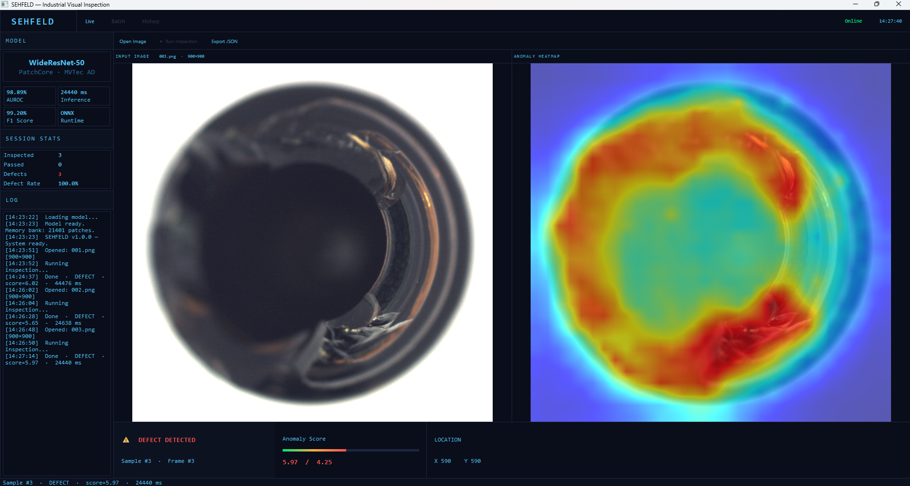
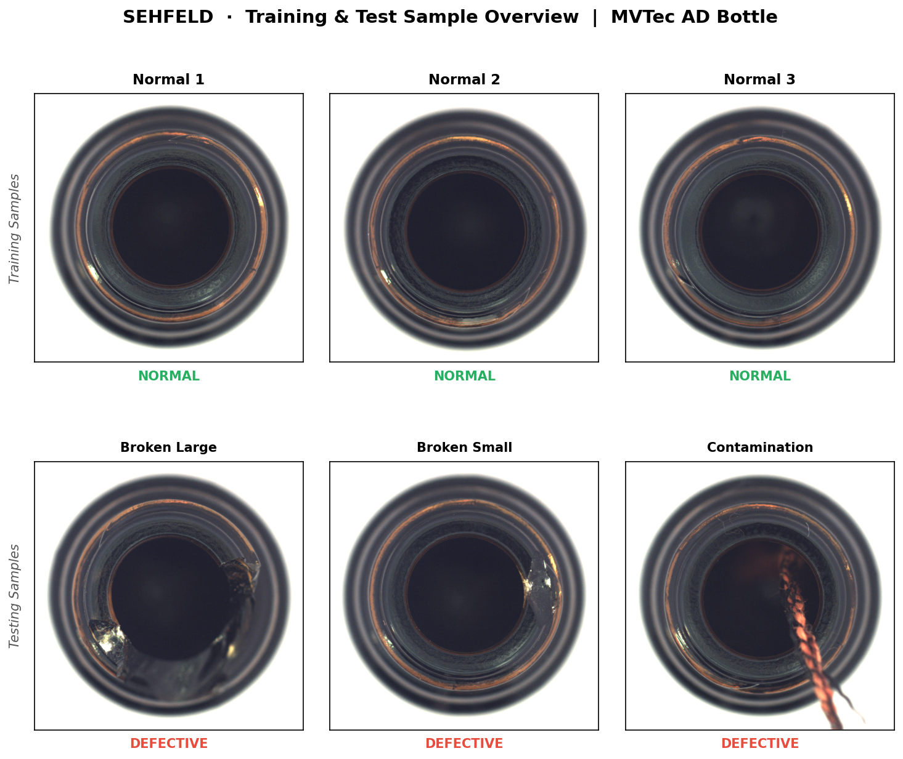
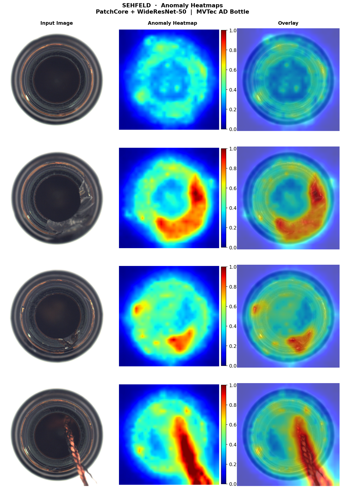
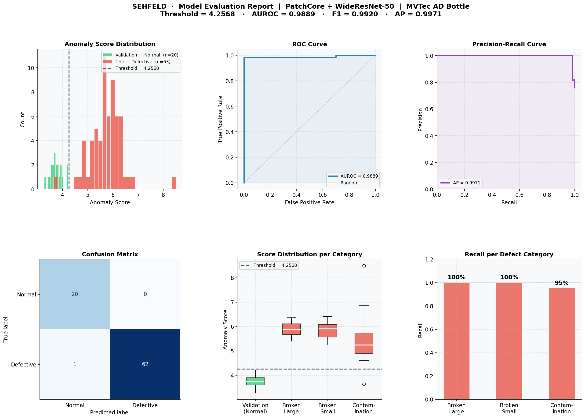
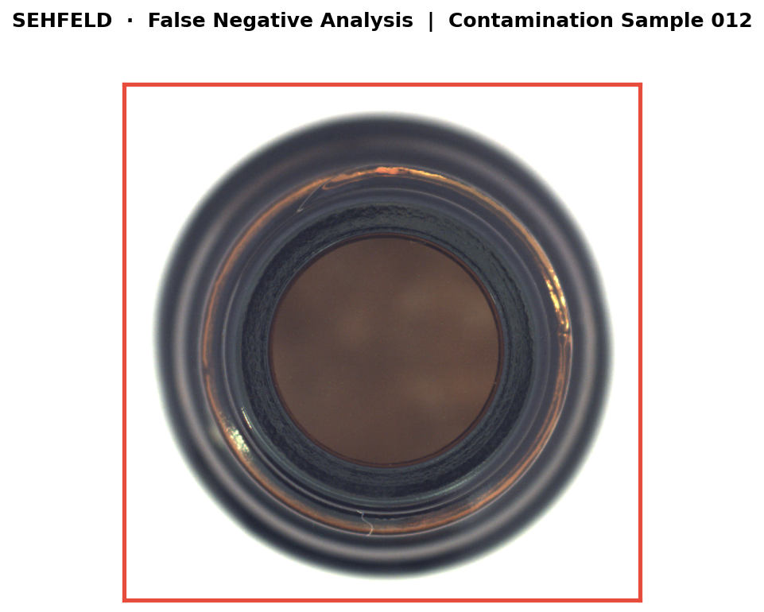

# SEHFELD — Industrial Visual Inspection System

AI-powered anomaly detection for industrial quality control


---

## Overview

SEHFELD is a real-time industrial visual inspection desktop application built in C++17 with Qt 6. It uses a **PatchCore** anomaly detection model backed by **WideResNet-50** to identify surface defects in manufactured products — achieving **98.89% image AUROC** on the MVTec AD Bottle dataset.

The system requires no defective samples during training. It learns a memory bank of normal patch features and flags anomalies at inference time using exact nearest-neighbor search with a FAISS IndexFlatL2 index.

---

## Features

- **Live Inspection** — Load an image and run anomaly detection in a single click
- **Anomaly Heatmap** — Visual overlay showing defect location and severity
- **Batch Processing** — Run inspection on an entire folder of images
- **History & Export** — Full inspection history with JSON export per sample or batch
- **DPI-Aware UI** — Scales automatically across screen resolutions
- **Dark Theme** — Clean midnight-blue UI with accent-based status feedback

---

## Demo

### Application Screenshot
*Live inspection — defect detected with anomaly heatmap overlay and result strip*



### Dataset Samples
*Normal training samples (top) vs defective test samples (bottom) — broken large, broken small, contamination*



### Anomaly Heatmaps
*Input image · Anomaly heatmap · Overlay — normal sample (top) followed by broken large, broken small, and contamination defects*



### Model Evaluation Report
*Anomaly score distribution · ROC Curve · Precision-Recall Curve · Confusion Matrix · Score distribution per category · Recall per defect category*



### False Negative Analysis
*The model's only missed detection — contamination/012.png with score 3.6359, below the calibrated threshold of 4.2568. The defect is visually indistinguishable from normal texture.*



---

## Model Performance

| Metric | Value |
|--------|-------|
| Algorithm | PatchCore + WideResNet-50 |
| Dataset | MVTec AD — Bottle |
| Image AUROC | **98.89%** |
| Image F1 | **99.20%** |
| Threshold | 4.2568 |
| Memory Bank | 21,401 × 1,536 patches |
| Index | FAISS IndexFlatL2 |
| Inference Time | ~24s on Intel Core i5-10210U (CPU only) |

---

## Limitations

**Defect Area Measurement**
Accurate physical defect measurement is not supported. It requires camera calibration data (mm per pixel), knowledge of the bottle's optical properties, and a controlled lighting setup to eliminate specular reflections on glass — none of which are available in the MVTec AD dataset.

**Inference Speed**
Inference runs on CPU only (~24s on Intel Core i5-10210U). GPU acceleration is not yet enabled — adding ONNX Runtime's CUDA execution provider would reduce inference time significantly on any CUDA-capable GPU.

---

## Tech Stack

| Component | Technology |
|-----------|-----------|
| Language | C++17 |
| UI Framework | Qt 6.11 MSVC2022 64-bit |
| Computer Vision | OpenCV 4.10 (vc16) |
| ML Runtime | ONNX Runtime 1.20.1 |
| Vector Search | FAISS IndexFlatL2 |
| Build System | CMake + Ninja |
| IDE | Qt Creator |
| Platform | Windows 11 |

---

## Project Structure

```
Sehfeld/
├── app/
│   ├── main.cpp
│   ├── mainwindow.h
│   ├── mainwindow.cpp        ← UI logic, styles, DPI scaling
│   ├── mainwindow.ui         ← Qt Designer layout
│   └── src/
│       ├── AnomalyDetector.hpp / .cpp   ← PatchCore inference, FAISS search
│       ├── Reporter.hpp / .cpp          ← JSON export
│       └── sal_mingw.hpp               ← SAL annotation stubs for ONNX Runtime
├── notebook/
│   └── SEHFELD.ipynb         ← Training, evaluation, and export pipeline
├── results/
│   ├── sehfeld_screenshot.png
│   ├── sehfeld_analysis.png
│   ├── sehfeld_dataset_samples.png
│   ├── sehfeld_heatmap_results.png
│   └── sehfeld_fn_analysis.png
├── .gitignore
├── CMakeLists.txt
└── README.md
```

> **Note:** Model files (`sehfeld_backbone.onnx`, `sehfeld_memory_bank.bin`) are not included due to file size. Run the notebook to generate them.

---

## Requirements

- Windows 11
- Qt 6.11 — Desktop Qt 6.11.0 MSVC2022 64-bit
- Qt Creator
- OpenCV 4.10 (vc16 build)
- ONNX Runtime 1.20.1
- FAISS (built as static library)

---

## Build & Run

### 1. Clone the repository

```bash
git clone https://github.com/Mohammad-Kharabsheh/Sehfeld.git
cd Sehfeld
```

### 2. Generate model files

Model files are not included in the repository due to file size. To generate them, run all cells in `notebook/SEHFELD.ipynb` on Google Colab. The notebook will produce:

```
model/
├── sehfeld_backbone.onnx
├── sehfeld_backbone.onnx.data
└── sehfeld_memory_bank.bin
```

Place the generated files in a `model/` directory at the project root.

### Training Environment

The model was trained on **Google Colab** (T4 GPU) due to local hardware constraints. The training notebook can also be run on any machine with:
- A CUDA-capable GPU with sufficient VRAM
- Jupyter Notebook or JupyterLab

> Some paths and Colab-specific cells (e.g. `files.download()`) may need adjustment when running outside Google Colab.

### 3. Configure model paths

In `app/mainwindow.cpp`, update the CONFIG section:

```cpp
static const std::string ONNX_PATH    = "path/to/model/sehfeld_backbone.onnx";
static const std::string MEMBANK_PATH = "path/to/model/sehfeld_memory_bank.bin";
```

### 4. Build with Qt Creator

1. Open Qt Creator
2. Open `CMakeLists.txt` as a project
3. Select the **Desktop Qt 6.11.0 MSVC2022 64-bit** kit
4. Click **Build** → **Build Project**

### 5. Required DLLs

Place these beside the executable:

```
onnxruntime.dll
onnxruntime_providers_shared.dll
opencv_world4100.dll
```

---

## Usage

1. Launch the application
2. Click **Open Image** to load an image
3. Click **Run Inspection** to run anomaly detection
4. View the result in the heatmap panel and result strip
5. Click **Export JSON** to save the inspection report

For batch processing, switch to the **Batch** tab and select a folder.

---

## Dataset

This project uses the **MVTec Anomaly Detection Dataset** — a comprehensive benchmark for unsupervised anomaly detection in industrial images.

The Bottle category used in this project is available on Kaggle:
[MVTec AD on Kaggle](https://www.kaggle.com/datasets/ipythonx/mvtec-ad)

> Bergmann et al., "MVTec AD — A Comprehensive Real-World Dataset for Unsupervised Anomaly Detection", CVPR 2019.

---

*Built by Mohammad Kharabsheh*
